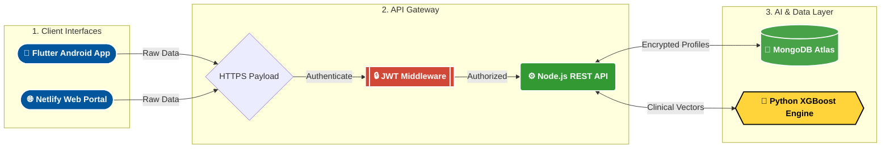

<div align="center">


# 🤍 HeartSafe Ecosystem 🤍
<p><i>An Enterprise-Grade, AI-Powered Coronary Heart Disease Diagnostic Pipeline</i></p>

<br/>

<p align="center">
  
  
  
</p>

<blockquote>
  <b>A highly scalable, cross-platform health analytics pipeline engineered to process complex clinical patient metrics and instantly formulate 10-year CHD risk vectors. Optimized strictly for high availability, zero-trust data security, and predictive diagnostic precision.</b>
</blockquote>

<br/>

<a href="https://heartsafechdpred.netlify.app/">
  
</a>
<a href="https://heartsafe-backend.onrender.com/api/health">
  
</a>
<a href="https://github.com/sathishr-ai/HeartSafe-FullStack/releases/download/v1.0/app-release.apk">
  
</a>

<br/><br/>

</div>

---


> *Live rendering of isolated clinical data parameters bridging the Native Android Kotlin ecosystem with responsive HTML5 payloads.*

### 🌐 Web Dashboard (Clinical Risk Assessment)
<p align="center">
  
  &nbsp;
  
</p>

### 📱 Android Application (Flutter Native UI)
<p align="center">
  
  &nbsp;&nbsp;&nbsp;&nbsp;&nbsp;&nbsp;&nbsp;&nbsp;&nbsp;&nbsp;&nbsp;&nbsp;
  
</p>

### 📱 Database
<p align="center">
  
</p>

---


Cardiovascular anomalies are universally the leading cause of global mortality. Within modern intensive care and diagnostic data evaluation, **speed, predictive accuracy, and scalability are actively paramount.**

**HeartSafe** was physically developed to architect a bridge between theoretical abstract machine learning algorithms and real-world clinical adoption. By securely networking a heavily-tuned **XGBoost Inference microservice** underneath an asynchronous **Node.js REST Gateway**, this architecture successfully relays real-time predictive diagnostic assessments directly back to the hands of medical professionals through a **Flutter cross-platform client**.

This ecosystem definitively proves strict adherence to modern deployment pipelines, actively highlighting stateless JWT authentication walls, remote NoSQL clustering (MongoDB Atlas), and robust edge management.

---


To ensure absolute clarity for technical recruiters, the system architecture operates on a streamlined **3-Tier Pipeline**. It securely channels medical input through an encrypted NodeJS Gateway, processes diagnostics asynchronously in Python, and persists profiles globally via MongoDB.



---


<div align="center">


| Operational Layer | Core Technology | Deep Engineering Rationale |
|:---|:---|:---|
| **Frontend UI/UX Engine** | **Flutter** | Chosen for its strictly unified codebase. Compiles natively hyper-optimized ARM device code for Android hardware while concurrently rendering dynamic HTML5 payloads for Web deployment. |
| **API Gateway Microservice** | **Node.js + Express** | Chosen specifically to provide a highly-scalable, event-driven, non-blocking gateway capable of digesting immense, asynchronous clinical data arrays without crashing the main thread. |
| **Persistence Database** | **MongoDB Atlas** | The infinitely flexible BSON document schema intrinsically natively supports deeply-nested health sub-arrays and wildly shifting historical diagnostic logging parameters. |
| **Machine Learning Pipeline** | **Python (XGBoost)** | Intentionally selected over Random Forest modeling for its phenomenally superior handling of starkly imbalanced medical data variables and optimized gradient-boosting analytical regularization matrix. |

</div>

---


> *Rigorous multi-algorithm benchmarking was conducted to scientifically validate the optimal classifier for clinical CHD prediction. XGBoost was selected as the production model based on its superior performance across all key diagnostic metrics.*

<div align="center">

| Algorithm | Accuracy | Precision | Recall | F1-Score | AUC-ROC |
|:---|:---:|:---:|:---:|:---:|:---:|
| Logistic Regression | 85.3% | 84.1% | 83.7% | 83.9% | 0.89 |
| Support Vector Machine | 87.6% | 86.9% | 86.4% | 86.6% | 0.91 |
| Random Forest | 89.2% | 88.5% | 87.9% | 88.2% | 0.94 |
| Neural Network (MLP) | 90.1% | 89.5% | 89.8% | 89.6% | 0.95 |
| **🏆 XGBoost (Selected)** | **91.5%** | **90.8%** | **91.2%** | **91.0%** | **0.96** |

</div>


### 🔐 1. Absolute Zero-Trust Architecture
- **Stateless Verification:** The entire gateway is driven by isolated `JWT` (JSON Web Token) infrastructure.
- **Cryptographic Hashing:** Clinical user authentication credentials are mathematically obscured through intense `Bcrypt` multi-pass salting operations prior to database entry.
- **Cross-Origin Locking:** Explicit environment-based **CORS** protocols strictly deny ingress payloads from unverified external host domains.

### 📈 2. Distributed Micro-Batch Processing
- Provides a proprietary administrative interface designed expressly for `multi-part/form-data` ingestions.
- The Node.js worker iteratively maps, radically normalizes, and feeds mass data sets into the Python Engine using highly synchronized parallel array mapping matrices, generating complex chart plots near-instantly.

### 📄 3. Autonomous Predictive Engine (Sample Payload)
The ecosystem algorithmically compiles variables and streams binary health mappings asynchronously. 

<details>
<summary><b>View Required XGBoost Inference Payload (JSON)</b></summary>

```json
POST /api/predict/single
{
  "age": 55,
  "sex": 1,
  "cp": 2,
  "trestbps": 140,
  "chol": 240,
  "fbs": 0,
  "restecg": 1,
  "thalach": 150,
  "exang": 0,
  "oldpeak": 1.5,
  "slope": 2,
  "ca": 0,
  "thal": 2
}

// SUCCESS RESPONSE: 200 OK
{
  "chd_probability": 87.4,
  "risk_category": "High Risk",
  "generated_report_id": "REP-849-2A"
}
```
</details>

---


> *Complete HTTP endpoint map powering the HeartSafe diagnostic pipeline. All routes are served under the base URL:* `https://heartsafe-backend.onrender.com`

<div align="center">

| Method | Endpoint | Auth | Description |
|:---:|:---|:---:|:---|
| `POST` | `/api/auth/login` | ❌ | Authenticate user credentials and return session token |
| `POST` | `/api/auth/register` | ❌ | Create a new clinical user account |
| `POST` | `/api/auth/logout` | ❌ | Terminate the active user session |
| `POST` | `/api/predictions/single` | ✅ | Submit single patient data and receive CHD risk score |
| `POST` | `/api/predictions/batch` | ✅ | Upload multi-patient CSV array for mass risk analysis |
| `GET` | `/api/predictions/list` | ✅ | Retrieve all historical prediction records from MongoDB |
| `POST` | `/api/exports/pdf` | 🔒 | Generate and export a PDF diagnostic report |
| `POST` | `/api/exports/csv` | 🔒 | Convert batch predictions into downloadable CSV format |
| `POST` | `/api/followup/schedule` | ✅ | Schedule a clinical followup appointment |
| `GET` | `/api/followup/list` | ✅ | Fetch all scheduled followup entries |
| `PUT` | `/api/followup/:id` | ✅ | Update an existing followup record |
| `DELETE` | `/api/followup/:id` | ✅ | Remove a followup entry by ID |
| `GET` | `/api/health` | ❌ | Verify live server status and uptime |

</div>

<p align="center">
  <sub>❌ Public &nbsp;&nbsp; ✅ Token Required &nbsp;&nbsp; 🔒 JWT Middleware Protected</sub>
</p>

---


Want to run the pipeline locally and intercept the Neural Network payloads?

```bash
# 1. Clone the master matrix
git clone https://github.com/sathishr-ai/HeartSafe-FullStack.git

# 2. Boot the API Gateway
cd HeartSafe-FullStack/backend
npm install
npm run dev

# 3. Mount the Global Environment (.env)
# Create a .env file containing your cluster hashes
MONGO_URI=mongodb+srv://<user>:<password>@cluster0.db.net/heartsafe
JWT_SECRET=your_hyper_secure_hash
PORT=5000

# 4. Launch the Native Frontend (Android)
cd ../chd_flutter_app
flutter pub get
flutter run
```

---


<details>
<summary><b>🔍 Tap Here to Expand the Internal Directory Map</b></summary>
<br/>

```text
HeartSafe-FullStack/
│
├── 📱 chd_flutter_app/                   # Local Native Kotlin/Dart Compilation Unit
│   ├── lib/
│   │   ├── main.dart                     # Flutter App Initialization Bootstrap
│   │   ├── models/                       # Type-Safe Object DTO Classes
│   │   ├── screens/                      # Interactive Front-End Stateless/Stateful Trees
│   │   └── services/                     # WebClient HTTPS Network Interactors
│   └── pubspec.yaml                      # Root Dependency Ledger
│
├── ⚙️ backend/                           # Node.js V8 Vercel Server Allocation 
│   ├── config/database.js                # Secure Asynchronous Cloud Ingress Configuration
│   ├── controllers/                      # Core Route Algorithmic Execution Logic
│   ├── middleware/                       # Critical Authorization Wall Logic
│   ├── models/                           # Enforced Mongoose Relational Schemas
│   ├── python/                           # XGBoost Python Environment
│   │   ├── train_model.py                # Hyper-parameter Tuning Logic
│   │   ├── predict.py                    # Inference Terminal Process Map
│   │   └── final_model.pkl               # Frozen Binary Weights Matrix
│   ├── routes/                           # API URI Payload Translators
│   └── server.js                         # Root App Daemon Initialization
│
└── 🌐 CChd.prediction.html               # Headless Client Render Instance
```

</details>

---


<div align="center">
  <h3>Sathish R</h3>
  <b>Full-Stack Architect | Emerging Software Engineer | AI Integration Specialist</b>
  <p>I am fervently dedicated to architecting massively scalable networking solutions that tangibly integrate bleeding-edge artificial intelligence to neutralize deep, real-world complexity issues.</p>
  
  <a href="https://github.com/sathishr-ai">
    
  </a>
  <a href="https://www.linkedin.com/in/sathish-r-2393412a5">
    
  </a>
  <a href="mailto:sathxsh57@gmail.com">
    
  </a>
</div>

<br/>
<div align="center">
  
</div>
