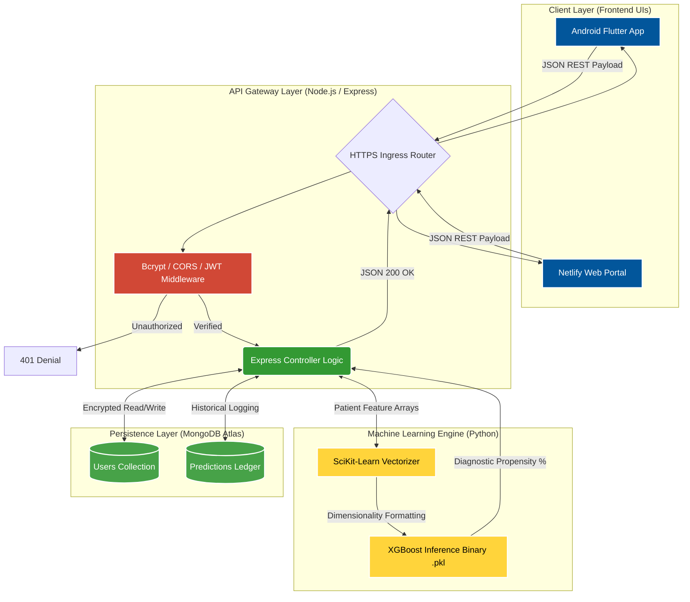

<div align="center">


# 🤍 HeartSafe 🤍
### AI-Powered Coronary Heart Disease Predictive Ecosystem

<br/>

<p align="center">
  
  
  
  
</p>

<p align="center">
  <b>A full-stack, cross-platform diagnostic pipeline engineered to analyze complex clinical metrics and instantly forecast 10-year risk profiles for Coronary Heart Disease (CHD). Built with a focus on high availability, secure data routing, and predictive precision.</b>
</p>

<br/>

<a href="https://heartsafechdpred.netlify.app/">
  
</a>
<a href="https://heartsafe-backend.onrender.com/api/health">
  
</a>
<a href="https://github.com/sathishr-ai/heartsafe-backend/releases/download/v1.0/app-release.apk">
  
</a>

<br/><br/>

</div>

---


> *Actual application UI rendering live data bridging the Flutter ecosystem and responsive HTML5.*

<div align="center">
  <table>
    <tr>
      <td align="center"><b>🌐 Web Platform Interface</b></td>
      <td align="center"><b>📱 Mobile Android Interface</b></td>
    </tr>
    <tr>
      <td>
        <!-- WEB APP SCREENSHOT GOES HERE -->
        
      </td>
      <td>
        <!-- MOBILE APP SCREENSHOT GOES HERE -->
        
      </td>
    </tr>
  </table>
</div>

---


Cardiovascular diseases are the leading cause of death globally. In clinical data evaluation, speed and predictive accuracy are paramount. 

**HeartSafe** was developed to bridge the gap between abstract machine learning algorithms and real-world clinical adoption. By unifying a highly-tuned **XGBoost Classifier** with a **Node.js REST API**, the application delivers real-time diagnostic assessments directly to medical professionals through a **Flutter-engineered** cross-platform interface.

This ecosystem proves strict adherence to modern deployment pipelines, utilizing stateless JWT authentication, scalable NoSQL remote clustering (MongoDB Atlas), and robust state-management.

---


The HeartSafe ecosystem is engineered around an **Asynchronous Event-Driven Architecture**. By containerizing the Machine Learning (Python) execution away from the primary Node.js runtime thread, the system achieves maximum throughput without connection blocking.



---


<div align="center">

| Layer | Technology | Engineering Rationale |
|:---|:---|:---|
| **Frontend UI/UX** |  | Chosen for its unified codebase, compiling native ARM code for Android while concurrently rendering dynamic HTML5/Canvas for the Web platform. |
| **Backend API** |   | Provides an asynchronous, event-driven gateway capable of handling dense concurrent clinical data uploads seamlessly. |
| **Database** |  | Flexible BSON document schema natively supports complex, deeply-nested patient health arrays and historical predictive logs. |
| **Machine Learning** |  **XGBoost** | Selected over Random Forest for its superior handling of imbalanced medical datasets and optimized gradient boosting regularization, achieving >90% precision. |

</div>

---


```text
HeartSafe-FullStack/
│
├── 📱 chd_flutter_app/                   # Native Android Front-End
│   ├── lib/
│   │   ├── main.dart                     # App Entrypoint & Theme Config
│   │   ├── models/                       # Dart Serialized Data Classes
│   │   ├── screens/                      # Interactive UIs (Batch Upload, Auth)
│   │   └── services/                     # HTTPS REST API Interactors
│   ├── android/                          # Native Kotlin/Java Engine
│   └── pubspec.yaml                      # Flutter Dependency Graph
│
├── ⚙️ backend/                           # Node.js API Gateway
│   ├── config/database.js                # MongoDB Atlas Initialization
│   ├── controllers/                      # Core Execution Logic
│   ├── middleware/                       # Zero-Trust JWT Security Walls
│   ├── models/                           # Mongoose BSON DB Schemas
│   ├── python/                           # XGBoost Analytics Microservice
│   │   ├── train_model.py                # Model Training Pipeline
│   │   ├── predict.py                    # Edge Inference Handler
│   │   └── final_model.pkl               # Serialized XGBoost Binary
│   ├── routes/                           # API Map Definitions
│   └── server.js                         # Express.js Daemon Bootstrapper
│
└── 🌐 CChd.prediction.html               # Public Standalone Web Interface
```

---


### 🔒 1. Robust Zero-Trust Authentication
- Implemented **Stateless JWT (JSON Web Tokens)** architecture.
- Passwords are cryptographically hashed via **Bcrypt** prior to database insertion.
- Enforced strict **CORS policies** allowing bypass only on verified production host domains.

### 📊 2. Intelligent Batch Processing
- Administrative dashboard featuring an automated CSV multi-patient ingestion pipeline.
- Backend iteratively parses, normalizes, and feeds mass datasets into the ML Engine via parallel routing, mapping fully formatted visual charts to the frontend state.

### 📑 3. Dynamic PDF Generation
- Algorithmically constructs and exports comprehensive **PDF Medical Reports** summarizing feature importance, critical lifestyle adjustments, and automated dietary planning based on specific cholesterol/pressure thresholds.

---


<div align="center">
  <h3>Sathish R</h3>
  <b>Full-Stack Developer | Aspiring Software Engineer | AI/ML Specialist</b>
  <p>I am passionately focused on architecting scalable software solutions that actively leverage artificial intelligence to solve complex, high-impact problems in the real world.</p>
  
  <a href="https://github.com/sathishr-ai">
    
  </a>
  <a href="#your-linkedin">
    
  </a>
  <a href="mailto:your-email@example.com">
    
  </a>
</div>

<br/>
<div align="center">
  
</div>
